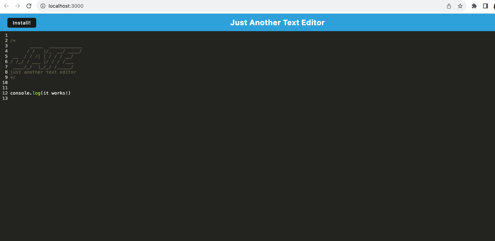

# Text Editor 

[](https://opensource.org/licenses/MIT)

## Description <a name="description"></a>

This progressive web application will allow a user to create notes or snippets with or without an internet connection so that the user can retrieve them for later use. 

## Table of Countents 
- [Description](#description)
- [Installation](#installation)
- [Usage](#usage)
- [License](#license)
- [Questions](#questions)

## Installation <a name="installation"></a>
When the user opens the application in the editor, they will see a client server folder structure. After running `npm run start:dev` from the root directory, the application will start up the backend and serve the client.When the user runs the text editor application from my terminal, all JavaScript files have been bundled using webpack.

After the user runs the webpack plugins, they will have a generated HTML file, service worker, and a manifest file. When the user runs next-gen JavaScript in the application, the text editor still functions in the browser without errors.

Once the user opens the text editor, IndexedDB has immediately created a database storage.When the user enters content and subsequently clicks off of the DOM window, the content in the text editor has been saved with IndexedDB. The content in the text editor has been retrieved from the IndexedDB once it has been reopened after it has been closed. 

Clicking on the Install button will download the web application as an icon on the user's desktop. When the user loads the web application, they have a registered service worker. Once the user registers a service worker, the user will have their static assets precached upon loading along with subsequent pages and static assets. When the user deploys to Render, it has proper build scripts for a webpack application. 



Code Snippet of workbox plug-ins for service worker file
```
module.exports = () => {
  return {
    mode: 'development',
    entry: {
      main: './src/js/index.js',
      install: './src/js/install.js'
    },
    output: {
      filename: '[name].bundle.js',
      path: path.resolve(__dirname, 'dist'),
    },
    plugins: [
      new HtmlWebpackPlugin({
        template: './index.html',
        title: 'Text Editor'
      }),
      new WebpackPwaManifest({
        name: 'Text Editor',
        short_name: 'Text Editor',
        description: 'A simple text editor',
        background_color: '#ffffff',
        crossorigin: 'use-credentials', 
        icons: [
          {
            src: path.resolve('./src/images/logo.png'),
            sizes: [96, 128, 192, 256, 384, 512] 
          },
          {
            src: path.resolve('./src/images/logo.png'),
            size: '1024x1024' 
          },
          {
            src: path.resolve('./favicon.ico'),
            size: '1024x1024',
            purpose: 'maskable'
          }
        ]
      }),
      new InjectManifest({
        swSrc: './src-sw.js',
        swDest: 'src-sw.js'
      })
    ],

    module: {
      rules: [
        {
          test: /\.css$/,
          use: ['style-loader', 'css-loader']
        },
        { 
          test: /\.js$/, 
          exclude: /node_modules/, 
          use: { 
            loader: 'babel-loader', 
            options: {
              presets: ["@babel/preset-env"],
              plugins: ["@babel/plugin-proposal-object-rest-spread", "@babel/transform-runtime"],

            },
          },   
        },
      ],
    },
  };
};

```

## Usage <a name="usage"></a>
This application is meant to allow a user to create notes or snippets with or without an internet connection so that the user can retrieve them for later use. 


## License <a name="license"></a>
MIT License


## Questions <a name="questions"></a>

GitHub Profile: [github](https://github.com/abenedetti27)

Please direct any questions to:

Email: abenedetti27@gmail.com
